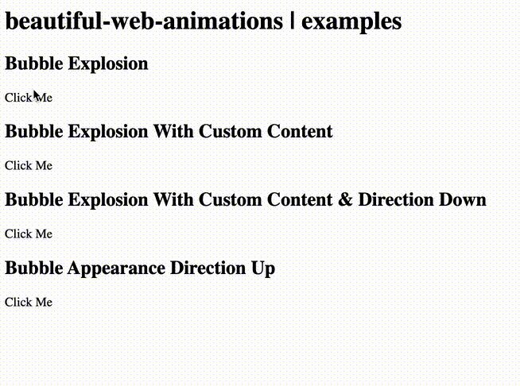

# beautiful-web-animations

Yet another collection of pre-made animations made for the web :)

See them all in action here: https://thibaultjanbeyer.github.io/beautiful-web-animations/

## Bubble Explosion

Usage:

```JavaScript
const BE = BubbleExplosion({ 
  element: document.querySelector('div'),
  eventListener: 'click', // optional, event on which the animation will start, default is 'click'
  content: '✅', // optional, this is the valid CSS content, default are bubbles (more info: https://developer.mozilla.org/en-US/docs/Web/CSS/content)
  particlesSize: 10, // optional, size of the explosion particles
  areaSize: 100, // optional, area size of the explosion
})

BE.trigger() // if no event listener is how you can trigger the animation programmatically
```

See examples section:
- [default](https://thibaultjanbeyer.github.io/beautiful-web-animations/#be)
- [with custom content](https://thibaultjanbeyer.github.io/beautiful-web-animations/#bec)


